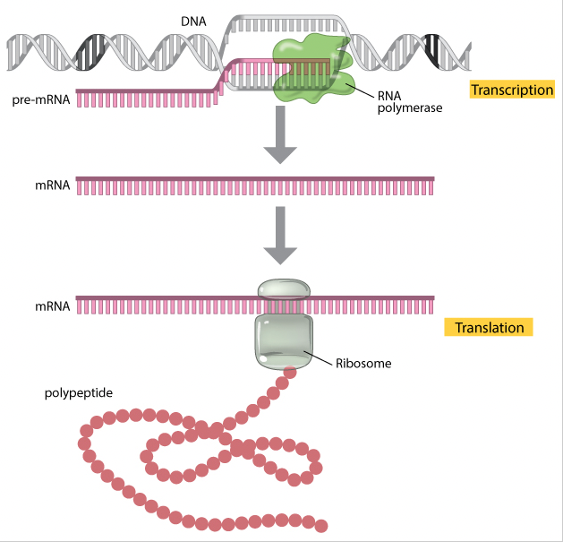

# Social Security Number (SSN) - Regex

In formal language theory, a regular expression (a.k.a. regex, regexp, or r.e.) is a string that represents a **regular (type-3) language**. 🧐 The only reason this is important is to note that the set of strings regular expressions are capable of matching goes way beyond what regular expressions from language theory can describe.

A Social Security Number (SSN) is a 9-digit number, typically formatted as three groups of numbers separated by hyphens: xxx-xx-xxxx.

There are approximately 453.7 million different sequences available for assignment. The Department of Social Security claims it uses 5.5. million new numbers annually, and statisticians say that the nine-digit SSN allows for approximately 1 billion possible combinations.

Assigned at birth, the SSN enables government agencies to identify individuals in their records and businesses to track financial information. Interestingly, the SSN sequences are not recycled according to the Department, and upon an individual's death the number is removed from the active files and is not reused. Recycling sequences may become an issue someday, and with analytics, we may be able to predict exactly when.

```diff
- Prior Limitations
```
Today, SSNs issues are random numbers, but that wasn't always the case. Before 2011, they were assigned regionally and in batches which limited the number of SSNs available for issuance to individuals by state. Before 2011, the nine-digit SSN was traditionally divided into 3 parts:

1) Area Numbers (*xxx*-xx-xxxx): first 3 digits originally represented the state in which a person first applied for a Social Security card.

2) Group Numbers (xxx-*xx*-xxxx): middle 2 digits were simply used to break all the SSNs with the same area number into smaller blocks.

3) Serial Numbers (xxx-xx-*xxxx*): last 4 digits within each group designation ran consecutively from 0001 through 9999.

> Speculation: ***more meaningful SSN sequences compromise randomization***

```diff
! Protecting the Integrity of Social Security Numbers
```

On July 3, 2007, the SSA published its intent to randomixe the nine-digit SSN in the Federal Register Notice, ***Protecting the Integrity of Social Security Numbers*** [Docket No. SSA 2007-0046]. SSN randomization affected the assignment process by:


- Eliminating the geographical significance of the first 3 digits of the SSN (area number) by no longer allocating by assignment to individuals in specific states
- Eliminating the significance of the highest group number and, making the High Group List forzen in time so it can only be used to see the area and group numbers SSA issued prior to randomization implementation
- Introducing previously unassigned area numbers exlucding 000, 666, and 900-999 (disadvantage)
- 

## Summary

A Regular Expression (regex) is a sequence of characters that define a search pattern. Regular expressions provide a generalized method to match patterns with diverse sequences.

Here, the task is to check whether a given string is a valid SSN or not by using Regular Expressions. The follow is a basic Regex pattern to verify that a given string is a valid SSN in this format:

> Example SSN match: 
>> 313-564-1837 
>> 000-482-9485

    `^\d{3}-\d{2}-\d{4}$`

        > Explanation:
        >> `^` matches the start of the string
        >> `\d{3}` matches three digits
        >> `-` matches a hyphen
        >> `\d{2}` matches two digits
        >> `-` matches another hyphen
        >> `\d{4}` matches four digits
        >> `$` matches the end of the string

While the regex above ***should*** technically match almost all SSNs, using this regex will still validate a small fraction of SSNs that include 000, 666, and digits between 900-999. According to the Department of Social Security, valid SSNs cannot have these digits in sequence. 

Below, is a regex that validates SSNs similarly to the regex above, but is a bit more accurate by excluding sequences with the first 3 digits equal to 000, 666, or between 900 and 999:

    ^(?!(000|666|9))\d{3}-(?!00)\d{2}-(?!0000)\d{4}$

        > Explanation: 
        >> `^` matches the start of the string
        >> `(?!...)` matches any 3-digits that are not followed by a specific string within `(?!...)`
        >> `(000|666|9)` excludes undesired values in the first group of 3 digits
        >> `\d{3}` matches three digits
        >> `-` matches a hyphen
        >> `(?!...)` matches any 2-digits that are not followed by a specific string within `(?!...)`
        >> `(..00)` excludes undesired values in the second group of 2 digits
        >> `\d{2}` matches two digits
        >> `-` matches another hyphen
        >> `(?!...)` matches any 3-digits that are not followed by a specific string within `(?!...)`
        >> `(..0000)` excludes undesired values in the last group of 4 digits
        >> `$` matches the end of the string


Overall, a valid SSN must satisfy the following conditions: 
1. It should have 9 digits
2. It should be divided into 3 parts by hyphen `[-]`
3. The first part (or group) should have 3 digits and should not be 000, 666, or beteen 900 and 999
4. The second part should have 2 digits and it should be from 01 to 99
5. The third part should have 4 digits and it should be from 0001 to 9999


> Just like writing any code, there are several ways to accomplish a successfull validation for Social Security Numbers. What if the SSNs are not all in the same format OR you want to change their format without doing so manually?! Let's discuss below!


## Table of Contents

- [Anchors](#anchors)
- [Quantifiers](#quantifiers)
- [Grouping Constructs](#grouping-constructs)
- [Bracket Expressions](#bracket-expressions)
- [Character Classes](#character-classes)
- [The OR Operator](#the-or-operator)
- [Flags](#flags)
- [Character Escapes](#character-escapes)

## Regex Components
Although their exact implementation can differ, components are generally characters that have a relatively universal use. Regular expression syntax is usually described in a grammatical form, but here we will describe it more loosly from bottom up, the way you would create one! At the bottom, are these basic components, also called atoms.


I am not sure if this will equate to the most ideal Big O Notation, I like to think of the process of regex matching like the process of DNA transcription and translation. I do believe human systems have almost perfected internal processes like DNA matchig, but we also unforuntely see mismatching, and it's consequences in cancer and other human mutations. This may be similar to where the regex passes through illegimate SSNs, even within a standard error rate. But I know human systems have multiple layers of validation, destructuring long sequences into digestable, matchable bits. Do regex have this ability to destructure, and potentially break validations into smaller bits in order to increase accuracy?... I don't know yet! 🙃

**match a regex with a target gene sequnce** 

- The enzyme (polymerase) that catalyze DNA synthesis in DNA replication goes through multiple sequences, while only matching and replicating the target DNA sequences

    -- like regex may run through several sequences and only matches one string

- Can be called from the 5' to 3' direction on either side of the double helix, and within different groups 
>> Does direction and segmented direction like during DNA replication with exponential growth in DNA strands upon splicing, increase the capacity for randomness of the random expression? 

- Initiated by start and stop sequences that are not variable amongst sequences

    -- like anchors, a non-unique regex copmonent

Can be affected by angles of interaction with the match, like the orientation of molecules or atoms (sub)

In moleclular biology and genetics, translation is the process of t




- While explaining the following regex components and their relation to validating SSN, we will use the following sequence as an example:
    > `901-33-4539`

### Anchors
    > Special sequences which match an empty substring.
        >> THINK: position or format

Anchors, or atomic zero-width assertions, cause a match to succeed or fail depending on the current position in the string, but they do not cause the engine to advance through the string or consume characters. 


The following are the anchors used in the regex pattern for validating a Social Security Number (SSN):

| Symbol         | Name               | Use                              | Validating SSN                                  | Pattern | Matches |
|---------------:|:------------------:|:--------------------------------:|:-----------------------------------------------:|:-------:|:-------:|
| `^`            | `caret`            | Matches the beginning of the target string or the beginning of the line (in multiline mode) | Ensures that the pattern must start at the beginning of the string | `^\d{3}` | `901-...` |
| `$`            | `dollar sign`      | Matches the end of the target string (or line in multiline mode) or before `\n` at the end of the string (or line in multiline mode) | Ensures that the pattern must end at the end of string | `-\d{4}` | `...-4539` |


Other Anchors:
| Symbol         | Use                                         | Pattern | Example SSN regex | Example Match |
|---------------:|:-------------------------------------------:|:-------:|:-----------------:|:-------------:|
| `\A`           | The match must occur at the start of the string | `\A\d{3}` | `\A\d{3}`-\d{2}-\d{4}$ | 
| `\Z`           | The match must occur at the end of the string or before `\n` at the end of the string| `-\d{3}\Z` | ^\d{3}-\d{2}-\d{4}`\Z` | 
| `\z`           | The match must occur at the end of the string | `-\d{3}\z` | ^\d{3}-\d{2}-\d{4}`\z` |
| `\G`           | Matches either: 1) the beginning of the string 2) the position that immediately follows the end of the previous match | `\G\(\d\)` | | `"(1)", "(3)", "(5)" in "(1)(3)(5)[7](9)"` |
| `\b`           | The match must occur on a boundary between a `\w` (alphanumeric) and a `\W` (nonalphanumeric) character | `\b\w+\s\w+\b` | | `"them theme", "them them" in "them theme them them` | 
| `\B`           | The match must not occur on a `\b` boundary (inverse of `\b`) | `\Bend\w*\b` | |  `"ends", "ender" in "end sends endure lender"` | 

> The use of the `^` and `$` anchors in the SSN validation pattern ensures that the pattern mut match the entire string, not just a portion of it. This is important for ensuring that only valid SSN formats are considered matches, and not just strings that contain the correct number of digits in the right order.
>> Anchors can change the behavior of matching a string like start and stop codons specify where target DNA sequences (e.g. genes) can be matched by DNA polymerase.


### Quantifiers

    > Elements that specify how many instances of the previous element must be present in the input string for a match to occur
        >> THINK: occurances or frequency

Quantifiers in regular expressions (regex) specify how many times the preceding character, group, or character class shoud match. 


The follow are quantifiers used in the regex pattern for validating a SSN:

| Symbol       | Use                              | Validating SSN                                  | Matches         |
|-------------:|:--------------------------------:|:-----------------------------------------------:|:---------------:|
| `{n}`        | Matches the previous element exactly `n` times | `\d{3}`, `\d{2}`, and `\d{4}` | `901`, `33`, and `4539` |


- breaking this quantifier down for SSN validation

| Quantifier   | Use                  | SSN Validation            | Matches    | 
|:------------:|:--------------------:|:-------------------------:|:----------:|
| `\d{3}`      | Specifies that the preceding `\d` character class should match exactly three times | Used to match the first group of three digits in the SSN | `901-...` |
| `\d{2}`      | Specifies that the preceding `\d` character class should match exactly two times | Used to match the second group of two digits in the SSN | `...-33-...` |
| `\d{4}`      | Specifies that the preceding `\d` character class should match exactly four times | Used to match the third group of four digits in the SSN | `...-4539` |

> The use of these quantifiers in the SSN validation pattern ensures that only strings with the correct number of digits in each group will be considered matches
>> This helps to prevent invalid SSN formats, such as strings with too few or too many digits, from being considered valid


**Modifying Regex With Quantifiers:**

- [x] With Quantifiers, we can also rewrite the bold portion of our more lengthy regular expression below: 

    ☞ [ ] ^(?!(000|666|9))\d{3}-(?!00)\d{2}-**(?!0000)**\d{4}$ 

    👉 [x] ^(?!(000|666|9))\d{3}-(?!00)\d{2}-**(?!0{4})**\d{4}$ 


| Changed                   | Replaced With                 | 
|:-------------------------:|:-----------------------------:|
| `(?!0000)`                | `(?!0{4})`                    |


⦿ ^**(?!666|000|9\d{2})\d{3}**-(?!00)\d{2}-**(?!0{4})**\d{4}$ ⦿


### Grouping Constructs

    > Delineate the subexpressions of a regular expression and capture the substrings of an input string
        > THINK: Recognizable groups or patterns to check

Grouping constructs in regular expressions are used to group parts of a pattern together and apply quantifiers or other operations to the entire group.

     ^\d{3}-\d{2}-\d{4}$

**There are no grouping constructs used in the basic SSN validation pattern shown above ⬆️, as the pattern only consists of individual charactrers, character classes, quantifiers, and anchors. This is because the pattern is used to match the entire string, so it is not neccessary to group portions of the pattern together.**

    ^(?!666|000|9\d{2})\d{3}-(?!00)\d{2}-(?!0{4})\d{4}$

**However, there are grouping constructs in the longer SSN regex shown above ⬆️. So let's discuss this!**


<!-- Let's say you want to match the term `SSN:` that usually precedes the 9-digit number, but you do not want to capture these characters. | 
- BUT how can we apply Grouping Constructs to SSN regex validation? 
    - Let's think of a real-life example!

    > Example: I have hundreds of SSNs and want to find and replace all digits with an 'X' except the last 4

Regular expression search:
- Assigns full match to `Group 0`
- () means that that part of the full match should be captured separatetly as a different group
    - Groups numbered left to right, Group 0 being the full match, Group 1 being the captured group farthest to the left, Group 2 being the captured group located to the right of Group 1, etc.
| `(?:)`         | Non-capturing Group | Similar to capturing groups, but do not capture the text matched by the group. This is useful when applying operations to a group of characters but do not need to capture the matched text. | `(?:abc){3}` | `abcabcabc` (no groups) | | | -->
 <!-- `(\d{3}-\d{2}-\d{4}\s)+` | Let's say you had several SSN numbers separated single whitespaces. Instead of the `^` and `$` anchors defining the acceptable start and end matches for one sequence, this may be able to separate and validate several SSN numbers placed together.  -->

In general, the main grouping constructs used in this regex for validating SSNs are:


| Symbol         | Name               | Use                              |(A) Random Pattern | (A) Matches | Example Grouping Constructs for Validating SSN |  |
|---------------:|:------------------:|:--------------------------------:|:-------:|:-------:|:------------------------:|:---------:|
| `()`           | Capturing Group    | Used to group parts of the pattern together and capture the matched text. The captured sequence can be accessed through group references with a numbered backreference, such as `/1`, `/2`..., or `$1`, `$2`,.., etc. Within the group, you can apply quantifiers and other operations to the entire group. | `(\w+\s)+` | Matches one or more word characters followed by a whitespace, repeated one or more times | `(?!666⏐000⏐9\d{2})`, `(?!00)`, `(?!0{4})` | 3 groups captured by the SSN regex shown above; returns true if the string matches and does not contain excluded values | 
| `(?!)`         | Negative Lookahead | Will only match if the capturing group does not match | (i) `match(?!element)` or (ii) `z(?!a)` |(i) Element cannot follow match in order to be a successful match (exludes values ahead in the regex); (ii) Matches the first "z" but not the "z" before the "a" | `(?!0{4})` | Regex will not match the SSN ending in a group of 4 zeros as the last 4 digits | 

Capturing Groups:

| Symbol | References | Use |
|:------:|:----------:|:---:|
| `$1`   | the first captured group (leftmost) | mostly used for replacements |
| `\1`   | backreferences to the first (leftmost) capturing group within the regular expression itself | mostly used for reference |


**Modifying Regex With Grouping Constructs:**

- [x] Along with Quantifiers, we can use Grouping Constructs to rewrite the bold portion of our more lengthy regular expression below:

    ☞ [ ] ^**(?!(000|666|9))\d{3}**-(?!00)\d{2}-(?!0{4})\d{4}$ 

    👉 [x] ^**(?!666|000|9\d{2})\d{3}**-(?!00)\d{2}-(?!0{4})\d{4}$


| Changed                   | Replaced With                 |
|:-------------------------:|:-----------------------------:|
| `(?!(000⎸666⎸9))\d{3}`     | `(?!666⎸000⎸9\d{2})\d{3}`                     |

- Parentheses Contents in the Match
    - Each sub-pattern inside a pair of parenthesis will be captured as a group
    - Capturing groups are numbered by counting their opening parenthesis from left to right
        > For example, take the regex:

             ^(?!666|000|9\d{2})\d{3}-(?!00)\d{2}-(?!0{4})\d{4}$

        - Group 0 (at index 0): the full match (full regular expression)

            > `^(?!666|000|9\d{2})\d{3}-(?!00)\d{2}-(?!0{4})\d{4}$`

        - Group 1 (at index 1): the contents of the first parenthesis

            > `(?!666|000|9\d{2})`

        - Group 2 (at index 2): the contents of the second parenthesis

            > `(?!00)`

        - Group 3 (at index 3): the contents of the third parenthesis

            > `(?!0{4})`


| Regex Portion                 | Represents                        | Why?                                      |
|:-----------------------------:|:---------------------------------:|:-----------------------------------------:|
| `(?!666⏐000⏐9\d{2})`          | Group 1 | The first 3 digits should **not** start with 000, 666, or between 900 and 999;  `(?!...)` looks ahead to exclude sequences that have 000, 666, or 900, 901, 902, 903, ....999 (any 3 digits that start with 9 where `⏐9\d{2}` tells us to also exclude values starting in 9 and proceeding with any 2 digits \d{2}) |
| 👀 `(?!...`                   | Negative Lookahead in Groups 1, 2, and 3 (and 0, of course)   | So there are no SSN matches with excluded values ahead |
| | | |
| (?!🙅‍♀️ `666⏐000⏐...`              | Group 1 | 3 digits to look ahead for and fail a SSN in Group 1 with values `000` or `666` |
| (?!🙅‍♀️ `...⏐9\d{2})`              | Group 1 | 1 digit (`9`) to look ahead for in combination with any two following digits to fail a SSN in Group 1 with values between `900` and `999` | 
| | | |
| `(?!00)`                      | Group 2 | 2 digits to look ahead for that should be anywhere from 01-99; so any SSN with a 2-digit sequence in Group 2 that is `00` is not valid | 
| | | |
| `(?!0{4})`                 | Group 3 | 4 digits to look ahead for that should be any value from 0001-9999; so any SSN with a 4-digit sequence in Group 3 that is `0000` is not valid |

### Bracket Expressions

    > It matches any single character in that list enclosed by `[]`
        > If the first charater of the list is the caret `^`, then it matches any character NOT in the list
            > THINK: choices or options

Within a bracket expression, a range expresison consists of two characters separated by a hyphen. It matches any single character that sorts between the two characters, inclusive. 

| Syntax                    | Represents                        | Alternative or Equivalent                 |
|:-------------------------:|:---------------------------------:|:-----------------------------------------:|
|⭐️  `[:punct:]`            | Punctuation characters            | `! # $ % & ' ( ) * + , - . / : ; < = > ? @ [ \ ] ^ _ ʼ { | } ~` |
| `[:alnum:]`               | Alphanumeric characters           | `[0-9A-Za-z]`                             |
| `[:alpha:]`               | Alphabet characters               | `[A-Za-z]`                                |
| `[:blank:]`               | Blank characters                  | `space` and `tab`                         |
| `[:digit:]`               | Digits                            | `0 1 2 3 4 5 6 7 8 9`                     |


- While there are no bracket expressions in the two regular expressions for validating SSNs below, there are several ways we can incorporate bracket expressions.

1. `^\d{3}-\d{2}-\d{4}$`
2. `^(?!666|000|9\d{2})\d{3}-(?!00)\d{2}-(?!0{4})\d{4}$`

    - 🌎 Let's look at a real-life example: 
             `I have hundreds of Social Security Numbers, some separated by a hyphen and some separated by just a space. How can I match all of these SSNs with ONE regex?`

| Bracket Expression          | Represents                            | Example |
|:---------------------------:|:-------------------------------------:|:-------:|
| `[-]`                       | Specifies a character (hyphen) that could match a hyphen between digits in the SSN | `XXX-XX-XXXX` |
| `[\s]`                      | Specifies a space that could match the spaces between digits in the SSN | `XXX XX XXXX` |
| `[-\s]`                     | Specifies a hyphen or space that could match between groups of digits in the SSN | `XXX-XX-XXXX` or `XXX XX XXXX` |

SSN Regex Re-written with Bracket Expressions (to allow hyphens or spaces between digits):

1. ^\d{3}**[-\s]**-\d{2}**[-\s]**-\d{4}$
2. ^(?!666|000|9\d{2})\d{3}**[-\s]**-(?!00)\d{2}**[-\s]**-(?!0{4})\d{4}$


### Character Classes

Like discussed in the Bracket Expressions section, a `character class` or `character set` matches only one out of several characters (e.g. `[-]` matches XXX-XX-XXXX but not `XXX.XX.XXXX` or `XXX/XX/XXXX`). You can use a hyphen inside a character class to specify a range of characters (e.g. `[0-9]` instead excluding values like 00 in `[?!00]` with bracket expressions and OR operators discussed below). You can combine range and single characters (e.g. `[-\s]`) to match a hyphen or a whitespace.

| Classes, Inverse Classes  | Use                              | Pattern | Matches |
|--------------------------:|:--------------------------------:|:-------:|:-------:|
| `\d`, `\D`                | Any one digit/non-digit character | Digits are [0-9] | |
| `\w`, `\W`                | Any one word/non-word charactrer | Word characters are [a-zA-Z0-9_] | |
| `\s`, `\S`                | Any one space/non-space charactrer | Whitespace charactrers are [ \n\r\t\f] | |


- 🌎 Let's look at another real-life example of SSN validation with regular expressions:
    `I have several Social Security Numers, but I only want to keep the last 4 digits visible and redact the rest.`

        > Let's look at our regular expression and our example SSN
            REGEX: ^(?!666|000|9\d{2})\d{3}-(?!00)\d{2}-(?!0{4})\d{4}$
            SSN: 901-33-4539


| Portion of Regex | Group     | Grouping Symbol   | Digits Captured or Redacted | Refers to |
|:----------------:|:---------:|:-----------------:|:---------------------------:|:---------:|
| `(?!666⏐000⏐9\d{2})\d{3}`| Group 1 | `$1` | Redacted to `XXX` | first 3 digits masked by `x`|
| `(?!00)\d{2}` | Group 2 | `$2` | Redacted to `XX` | middle 2 digits masked by `x` |
| `(?!0{4})\d{4}` | Group 3 | `$3` | Captured with `$3` | last 4 digits captured by `$3` |
| `^(?!666⏐000⏐9\d{2})\d{3}-(?!00)\d{2}-(?!0{4})\d{4}$` | Group 0 | `$0` | combined: `XXX-XX-$3` | all 9 digits |


<!-- | `\\`           | To denote an escaped string literal |  -->

<!-- - Is there an expression that more accurately validates SSN?

        ^(?!666|000|9\\d{2})\\d{3}-(?!00)\\d{2}-(?!0{4})\\d{4}$

    > By using the double backslash,  -->


### The OR Operator

    > "OR" in regular expressions 
        > THINK: grouping and alternation

Grouping and alternation are core features of most modern regular expressions. You can use the `|` operator (logical OR) to match characters to either the left or right of the | operator.

- This reminds me of using the toUpperCase() and toLowerCase() functions in Javascript, but I would think the decision to use either or relies on the scope. With the Regex OR Operator, you can dynamically accept various sequences, and differentiate 

If we look back to the guidelines that SSN's have to fit, I did not follow the exact wording directed, I did the opposite!

    >  ^(?!666|000|9\d{2})\d{3}-(?!00)\d{2}-(?!0{4})\d{4}$
...
4. The second part should have 2 digits and it should be from 01 to 99
5. The third part should have 4 digits and it should be from 0001 to 9999


Using th OR operator, we exclude certain values including:

| Values Excluded | Group   | Probablility of Generating that Value |   |
|:---------------:|:-------:|:-------------------------------------:|:-:|
| `666`, `000`, `9xx` | $1 | 1 - (1/10 * 1/10) | x = [0-9] |

### Flags

### Character Escapes


## Author

A short section about the author with a link to the author's GitHub profile (replace with your information and a link to your profile)
